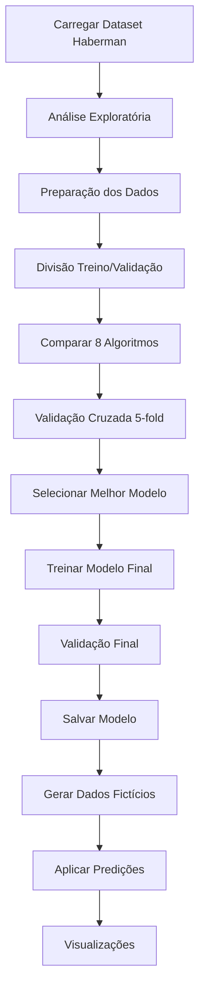

# Machine Learning Backend - Análise de Sobrevivência Haberman

[](https://opensource.org/licenses/MIT)
[](https://www.python.org/)
[](https://scikit-learn.org/)

Um projeto de Machine Learning para análise de sobrevivência de pacientes com câncer de mama usando o dataset Haberman, implementado com múltiplos algoritmos e validação cruzada.

## 📋 Descrição

Este projeto implementa uma análise completa de Machine Learning usando o famoso **Dataset Haberman** para prever a sobrevivência de pacientes que passaram por cirurgia de câncer de mama. O sistema compara 8 algoritmos diferentes e seleciona automaticamente o melhor modelo baseado em validação cruzada.

## 📊 Sobre o Dataset Haberman

O **Haberman's Survival Dataset** é um conjunto de dados clássico em Machine Learning, coletado no Hospital Billings de Chicago entre 1958 e 1970. Contém informações sobre pacientes que passaram por cirurgia de câncer de mama.

### Características do Dataset:
- **306 instâncias** de pacientes
- **4 atributos** (3 features + 1 target)
- **Sem valores faltantes**
- **Balanceamento**: ~75% sobreviveram (classe 1), ~25% não sobreviveram (classe 2)

### Atributos:
| Atributo | Tipo | Descrição | Faixa |
|----------|------|-----------|-------|
| `age` | int | Idade do paciente no momento da operação | 30-83 anos |
| `year` | int | Ano da operação | 1958-1969 |
| `nodes` | int | Número de nódulos linfáticos axilares positivos detectados | 0-52 |
| `survival_status` | int | **Target**: Status de sobrevivência (1=sobreviveu ≥5 anos, 2=morreu <5 anos) | 1 ou 2 |

### Importância Clínica:
- **Nódulos linfáticos** são o fator mais importante para prognóstico
- **Idade** pode influenciar na capacidade de recuperação
- **Ano da operação** reflete avanços médicos ao longo do tempo

## 🚀 Funcionalidades

- **Análise Exploratória**: Estatísticas descritivas e distribuição das classes
- **Comparação de Algoritmos**: Testa 8 algoritmos diferentes com validação cruzada
- **Seleção Automática**: Escolhe o melhor modelo baseado na acurácia
- **Validação Robusta**: Usa validação cruzada 5-fold para avaliação confiável
- **Geração de Dados**: Cria dataset fictício para demonstração
- **Visualizações**: Gráficos de performance e distribuições
- **Persistência**: Salva o melhor modelo treinado
- **API Backend**: Implementação com Flask em `api_ML.py`

## 🤖 Algoritmos Implementados

O sistema compara os seguintes algoritmos:

1. **Logistic Regression** - Classificação linear probabilística
2. **Random Forest** - Ensemble de árvores de decisão
3. **Support Vector Machine (SVM)** - Classificação com margens máximas
4. **K-Nearest Neighbors (KNN)** - Classificação baseada em proximidade
5. **Decision Tree** - Árvore de decisão simples
6. **Naive Bayes** - Classificação probabilística bayesiana
7. **Gradient Boosting** - Ensemble com boosting
8. **AdaBoost** - Adaptive boosting

## 🛠️ Tecnologias Utilizadas

- **Python 3.x**
- **pandas 2.0.3**: Manipulação e análise de dados
- **scikit-learn 1.3.0**: Algoritmos de Machine Learning
- **joblib 1.3.2**: Serialização eficiente do modelo
- **matplotlib**: Visualizações e gráficos
- **numpy**: Computação numérica
- **Flask 2.3.3**: Framework web (para API)

## 📦 Instalação

1. Certifique-se de ter o Python instalado (versão 3.8 ou superior recomendada).
2. Clone o repositório:
   ```bash
   git clone https://github.com/Gilmarregis/Projeto-Machine-Learning.git
   cd "Projeto-Machine-Learning"
   ```
3. Instale as dependências do projeto:
   ```bash
   pip install -r requirements.txt
   ```

## 🔧 Como Usar

### Executar o Treinamento Completo

```bash
python ML_model.py
```

Este comando irá:
1. **Carregar** o dataset Haberman (306 amostras)
2. **Analisar** os dados (estatísticas, distribuições)
3. **Comparar** 8 algoritmos com validação cruzada 5-fold
4. **Selecionar** o melhor modelo automaticamente
5. **Treinar** o modelo final nos dados completos
6. **Validar** com métricas detalhadas
7. **Salvar** o melhor modelo como `melhor_modelo_haberman.pkl`
8. **Gerar** dataset fictício para demonstração
9. **Aplicar** predições nos dados fictícios
10. **Criar** visualizações de performance

### Arquivos Gerados

Após a execução, os seguintes arquivos serão criados:
- `melhor_modelo_haberman.pkl` - Melhor modelo treinado
- `dados_ficticios_haberman.csv` - Dataset fictício para teste
- `predicoes_haberman.csv` - Predições nos dados fictícios
- Gráficos de visualização (exibidos na tela)

### Executar a API

```bash
python api_ML.py
```

A API estará disponível em http://localhost:5000/predict. Envie uma requisição POST com dados como:

```json
{
    "age": 45,
    "year": 1965,
    "nodes": 3
}
```

#### Exemplo de Resposta:

```json
{
    "survival_status": 1,
    "probabilidade_sobrevivencia": 0.78,
    "probabilidade_obito": 0.22,
    "algoritmo_usado": "Random Forest",
    "confianca": "Alta"
}
```

## 📈 Performance Esperada

Baseado no dataset Haberman, os algoritmos típicamente alcançam:

- **Acurácia**: 70-85% (dependendo do algoritmo)
- **Melhor algoritmo**: Geralmente Random Forest ou SVM
- **Baseline**: ~73% (predizer sempre a classe majoritária)
- **Validação cruzada**: Reduz overfitting e fornece estimativa confiável

### Métricas Avaliadas:
- **Acurácia**: Percentual de predições corretas
- **Precisão**: Verdadeiros positivos / (VP + Falsos positivos)
- **Recall**: Verdadeiros positivos / (VP + Falsos negativos)
- **F1-Score**: Média harmônica entre precisão e recall

## 🔄 Fluxo do Projeto



## 📁 Estrutura do Projeto

```
Machine Learning/
├── Machine Learning Backend.py    # Código principal
├── README.md                     # Este arquivo
└── logistic_regression_model.pkl # Modelo treinado (gerado após execução)
```

## 🤝 Contribuição

1. Fork o projeto
2. Crie uma branch para sua feature (`git checkout -b feature/AmazingFeature`)
3. Commit suas mudanças (`git commit -m 'Add some AmazingFeature'`)
4. Push para a branch (`git push origin feature/AmazingFeature`)
5. Abra um Pull Request

## 📝 Licença

Este projeto está sob a licença MIT. Veja o arquivo `LICENSE` para mais detalhes.

## 📞 Contato

Para dúvidas ou sugestões, entre em contato através dos issues do GitHub.

---

⭐ Se este projeto foi útil para você, considere dar uma estrela!
