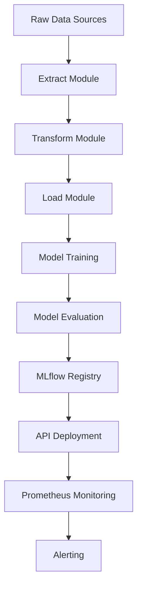
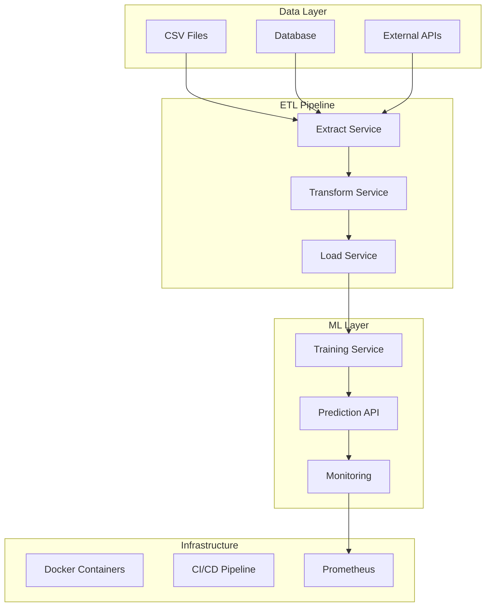

# Machine Learning Backend - Análise de Sobrevivência Haberman

[](https://opensource.org/licenses/MIT)
[](https://www.python.org/)
[](https://scikit-learn.org/)
[](https://github.com/Gilmarregis/Projeto-Machine-Learning/actions)
[](https://www.docker.com/)
[](https://mlflow.org/)
[](https://prometheus.io/)
[](https://codecov.io/gh/Gilmarregis/Projeto-Machine-Learning)

Um projeto **profissional** de Machine Learning para análise de sobrevivência de pacientes com câncer de mama usando o dataset Haberman, implementado com **pipeline ETL completo**, **CI/CD automatizado**, **containerização Docker**, **monitoramento Prometheus**, **MLOps** e **arquitetura modular**.

## 📋 Descrição

Este projeto implementa uma **solução completa de Machine Learning em nível empresarial** usando o famoso **Dataset Haberman** para prever a sobrevivência de pacientes que passaram por cirurgia de câncer de mama. O sistema utiliza **arquitetura modular**, **pipeline ETL profissional**, **múltiplos algoritmos** com **validação cruzada**, **seleção automática do melhor modelo** e **infraestrutura DevOps completa**.

## 🏗️ Arquitetura do Sistema

### Pipeline ETL Profissional


### Arquitetura de Microserviços


## 📊 Sobre o Dataset Haberman

O **Haberman's Survival Dataset** é um conjunto de dados clássico em Machine Learning, coletado no Hospital Billings de Chicago entre 1958 e 1970. Contém informações sobre pacientes que passaram por cirurgia de câncer de mama.

### Características do Dataset:
- **306 instâncias** de pacientes
- **4 atributos** (3 features + 1 target)
- **Sem valores faltantes**
- **Balanceamento**: ~75% sobreviveram (classe 1), ~25% não sobreviveram (classe 2)

### Atributos:
| Atributo | Tipo | Descrição | Faixa |
|----------|------|-----------|-------|
| `age` | int | Idade do paciente no momento da operação | 30-83 anos |
| `year` | int | Ano da operação | 1958-1969 |
| `nodes` | int | Número de nódulos linfáticos axilares positivos detectados | 0-52 |
| `survival_status` | int | **Target**: Status de sobrevivência (1=sobreviveu ≥5 anos, 2=morreu <5 anos) | 1 ou 2 |

### Importância Clínica:
- **Nódulos linfáticos** são o fator mais importante para prognóstico
- **Idade** pode influenciar na capacidade de recuperação
- **Ano da operação** reflete avanços médicos ao longo do tempo

## 🚀 Funcionalidades Principais

### 🔄 Pipeline ETL Modular
- **Extract**: Extração de dados de múltiplas fontes (CSV, Database, APIs)
- **Transform**: Limpeza, engenharia de features e tratamento de outliers
- **Load**: Persistência de dados processados e modelos com metadata

### 🤖 Machine Learning Avançado
- **8 Algoritmos**: Comparação automática com validação cruzada
- **MLflow Tracking**: Rastreamento de experimentos e modelos
- **Seleção Automática**: Escolha do melhor modelo baseado em métricas
- **Validação Robusta**: Cross-validation 5-fold para avaliação confiável

### 📊 Monitoramento e Observabilidade
- **Prometheus Metrics**: Métricas de performance em tempo real
- **Structured Logging**: Logs estruturados para debugging
- **Health Checks**: Verificação de saúde dos serviços
- **Alerting**: Alertas automáticos para anomalias

### 🐳 DevOps e Infraestrutura
- **Docker**: Containerização completa da aplicação
- **CI/CD**: Pipeline automatizado com GitHub Actions
- **Testing**: Testes unitários e de integração
- **Security**: Verificações de segurança automatizadas

## 🤖 Algoritmos Implementados

O sistema compara os seguintes algoritmos com otimização de hiperparâmetros:

1. **Logistic Regression** - Classificação linear probabilística
2. **Random Forest** - Ensemble de árvores com bagging
3. **Support Vector Machine (SVM)** - Classificação com margens máximas
4. **K-Nearest Neighbors (KNN)** - Classificação baseada em proximidade
5. **Decision Tree** - Árvore de decisão interpretável
6. **Naive Bayes** - Classificação probabilística bayesiana
7. **Gradient Boosting** - Ensemble com boosting sequencial
8. **Neural Network (MLP)** - Rede neural multicamadas

## 🛠️ Tecnologias e Stack

### Core ML Stack
- **Python 3.9+**: Linguagem principal
- **scikit-learn 1.3+**: Algoritmos de Machine Learning
- **pandas 2.0+**: Manipulação de dados
- **numpy**: Computação numérica
- **matplotlib/seaborn**: Visualizações

### MLOps Stack
- **MLflow**: Tracking de experimentos e registry de modelos
- **Prometheus**: Métricas e monitoramento
- **Docker**: Containerização
- **Flask**: API REST

### DevOps Stack
- **GitHub Actions**: CI/CD
- **pytest**: Framework de testes
- **flake8**: Linting de código
- **mypy**: Type checking
- **codecov**: Cobertura de código

### Infrastructure
- **Docker Compose**: Orquestração local
- **Makefile**: Automação de comandos
- **Requirements**: Gestão de dependências

## 📦 Instalação e Setup

### Pré-requisitos
- Python 3.9+
- Docker (opcional)
- Make (opcional)

### Instalação Local

```bash
# Clone o repositório
git clone https://github.com/Gilmarregis/Projeto-Machine-Learning.git
cd Projeto-Machine-Learning

# Instalar dependências
pip install -r requirements.txt

# Instalar dependências de desenvolvimento (opcional)
pip install -r requirements-dev.txt
```

### Instalação com Docker

```bash
# Build da imagem
docker build -f docker/Dockerfile -t ml-haberman .

# Executar container
docker run -p 5000:5000 ml-haberman

# Ou usar docker-compose
docker-compose -f docker/docker-compose.yml up
```

### Usando Makefile

```bash
# Ver todos os comandos disponíveis
make help

# Setup completo do ambiente
make setup

# Executar testes
make test

# Executar linting
make lint

# Treinar modelo
make train

# Executar API
make run-api

# Build Docker
make docker-build
```

## 🔧 Como Usar

### 1. Treinamento do Modelo

```bash
# Executar treinamento completo
python ML_model.py

# Ou usando make
make train
```

**O que acontece:**
1. **Extração**: Carrega dataset Haberman (306 amostras)
2. **Transformação**: Análise exploratória e preparação dos dados
3. **Comparação**: Testa 8 algoritmos com validação cruzada 5-fold
4. **Seleção**: Escolhe automaticamente o melhor modelo
5. **Treinamento**: Treina modelo final nos dados completos
6. **Validação**: Métricas detalhadas de performance
7. **Persistência**: Salva modelo como `best_model_nn.pkl`
8. **Logging**: Registra experimento no MLflow

### 2. Executar Pipeline ETL

```bash
# Executar pipeline completo
python -m src.data.extract
python -m src.data.transform
python -m src.data.load
```

### 3. API de Predição

```bash
# Iniciar API
python api_ML.py

# Ou usando make
make run-api
```

**Endpoint**: `POST http://localhost:5000/predict`

**Exemplo de requisição:**
```json
{
    "age": 45,
    "year": 1965,
    "nodes": 3
}
```

**Exemplo de resposta:**
```json
{
    "survival_status": 1,
    "probabilidade_sobrevivencia": 0.78,
    "probabilidade_obito": 0.22,
    "algoritmo_usado": "Neural Network",
    "confianca": "Alta",
    "timestamp": "2024-01-15T10:30:00Z"
}
```

### 4. Monitoramento

```bash
# Ver métricas Prometheus
curl http://localhost:5000/metrics

# Health check
curl http://localhost:5000/health
```

## 📁 Estrutura do Projeto

```
Machine Learning/
├── Machine Learning Backend.py    # Código principal
├── README.md                     # Este arquivo
└── logistic_regression_model.pkl # Modelo treinado (gerado após execução)
```

## 🤝 Contribuição

1. Fork o projeto
2. Crie uma branch para sua feature (`git checkout -b feature/AmazingFeature`)
3. Commit suas mudanças (`git commit -m 'Add some AmazingFeature'`)
4. Push para a branch (`git push origin feature/AmazingFeature`)
5. Abra um Pull Request

## 📝 Licença

Este projeto está sob a licença MIT. Veja o arquivo `LICENSE` para mais detalhes.

## 📞 Contato

Para dúvidas ou sugestões, entre em contato através dos issues do GitHub.

---

⭐ Se este projeto foi útil para você, considere dar uma estrela!
